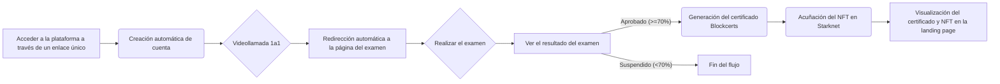

# App Flow - MentorCertAi

**Documentos de Referencia:**

* **spec.md:** Especificación detallada del proyecto.
* **plan.md:** Plan de desarrollo detallado con iteraciones y pasos.

## 1.  Mapa de Viaje del Usuario (Estudiante)



## 2. Puntos de Entrada
Punto de Entrada Principal: Enlace único a la plataforma (generación automática de cuenta del estudiante).

## 3. Rutas Críticas
Registro y Examen: Acceso a la plataforma -> Creación de cuenta -> Videollamada -> Redirección al Examen -> Realizar Examen -> Ver Resultado.
Certificación (Éxito): Flujo anterior + Generación de Certificado -> Acuñación de NFT -> Visualización en Landing Page.
Certificación (Fallo): Acceso a la plataforma -> Creación de cuenta -> Videollamada -> Redirección al Examen -> Realizar Examen -> Ver Resultado (Suspenso) -> Fin del flujo.

## 4. Puntos de Salida
Resultado del examen (Aprobado/Suspendido).
Visualización del certificado y NFT en la landing page.
Fin del flujo (si el estudiante suspende el examen).

## 5. Flujos de Interacción Principales (MVP)
Registro y Realización del Examen
Generación de Certificado y Acuñación de NFT
Visualización de Certificados y NFTs

## 6. Flujos de Manejo de Errores
Error en la obtención de la transcripción: Mostrar mensaje de error al usuario y reintentar la obtención (posiblemente con un límite de reintentos). Log del error para análisis posterior.
Error en la comunicación con el Agente de IA: Mostrar mensaje de error al usuario. Posiblemente ofrecer un examen alternativo predefinido (fuera del alcance del MVP si es muy complejo). Log del error.
Error en la interacción con la blockchain de Starknet: Manejar errores de transacción (fallo al acuñar el NFT). Reintentar la transacción (con un límite). Informar al usuario del problema. Log del error.
Errores de validación en el backend: Devolver códigos de error HTTP apropiados y mensajes de error descriptivos al frontend para que se puedan mostrar al usuario.
Errores inesperados: Capturar excepciones no manejadas y registrarlas en el log. Mostrar un mensaje de error genérico al usuario (evitar mostrar detalles técnicos).

## 7. Métricas de Éxito
Número de estudiantes registrados.
Número de exámenes realizados.
Porcentaje de estudiantes que aprueban el examen (calificación >= 70%).
Número de certificados generados.
Número de NFTs acuñados.
Número de estudiantes que visualizan sus certificados/NFTs en la landing page.
Tasa de errores por flujo (medir la frecuencia de los errores mencionados en la sección anterior).
Tiempo promedio para generar un examen después de la videollamada.
Tiempo promedio para acuñar un NFT después de la aprobación del examen.

## 8. Flujo de Interacción Detallado: Registro y Realización del Examen
### 8.1 Ruta Feliz
Fragmento de código

```mermaid
A[Estudiante accede al enlace de la plataforma] --> B{¿Existe la cuenta del estudiante?}
B -- No --> C[Crear nueva cuenta (correo, contraseña, nombre, apellido)]
B -- Sí --> D[Obtener transcripción de la videollamada]
D --> E[Enviar transcripción al Agente de IA]
E --> F[Recibir examen del Agente de IA]
F --> G[Mostrar examen al estudiante]
G --> H[Estudiante responde el examen]
H --> I[Enviar respuestas al backend]
I --> J[Corregir el examen]
J --> K{¿Calificación >= 70%?}
K -- Sí --> L[Mostrar resultado del examen (Aprobado)]
K -- No --> M[Mostrar resultado del examen (Suspendido)]
L --> N[Continuar con el flujo de certificación]
M --> O[Fin del flujo]
```

### 8.2 Escenarios de Error
Error al crear la cuenta:
Escenario: El correo electrónico ya existe en la base de datos.

Flujo:
Fragmento de código

```mermaid
A[Estudiante accede al enlace] --> B{¿Existe la cuenta?}
B -- No --> C[Intentar crear cuenta]
C -- Error --> D[Mostrar mensaje de error: "El correo electrónico ya está registrado"]
D --> E[Solicitar al estudiante que inicie sesión o use otro correo]
E --> O[Fin del flujo]
```

Error al obtener la transcripción:
Escenario: Fallo de la API de la plataforma de videollamadas, problema de conexión.

Flujo:
Fragmento de código

```mermaid
A[Estudiante accede al enlace] --> B{¿Existe la cuenta?}
B -- Sí --> D[Intentar obtener transcripción]
D -- Error --> E[Mostrar mensaje de error: "No se pudo obtener la transcripción. Por favor, inténtelo de nuevo más tarde."]
E --> O[Fin del flujo]
```

Mejora (fuera del MVP, pero ideal): Reintentar la obtención de la transcripción automáticamente varias veces antes de mostrar el error.
Error al comunicarse con el Agente de IA:
Escenario: Fallo de la API del Agente de IA, tiempo de espera excedido.

Flujo:
Fragmento de código

```mermaid
A[Obtener transcripción] --> E[Intentar enviar transcripción al Agente de IA]
E -- Error --> F[Mostrar mensaje de error: "No se pudo generar el examen. Por favor, inténtelo de nuevo más tarde."]
F --> O[Fin del flujo]
```

Mejora (fuera del MVP, si es factible): Usar un examen predefinido como respaldo.
Error al enviar las respuestas del examen:
Escenario: Problema de conexión entre el frontend y el backend.

Flujo:
Fragmento de código

```mermaid
H[Estudiante responde el examen] --> I[Intentar enviar respuestas]
I -- Error --> J[Mostrar mensaje de error: "No se pudieron enviar las respuestas. Por favor, inténtelo de nuevo."]
J --> K[Permitir al estudiante reintentar el envío]
K -- Exito --> L[Continuar con la corrección]
K -- Fallo --> O[Fin del flujo]
```

Error al corregir el examen:
Escenario: Error inesperado en el backend al procesar las respuestas. (Este error debería ser raro si hay pruebas unitarias).

Flujo:
Fragmento de código

```mermaid
I[Enviar respuestas al backend] --> J[Intentar corregir el examen]
J -- Error --> K[Mostrar mensaje de error: "Hubo un error al corregir el examen. Por favor, contacte con el soporte."]
K --> O[Fin del flujo]
```

Nota: En todos los escenarios de error, es crucial registrar el error en el backend con la mayor cantidad de detalles posible (fecha, hora, usuario, mensaje de error, stack trace, etc.) para facilitar la depuración.